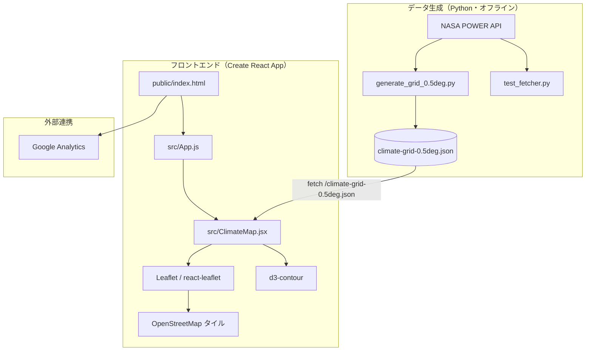

# 芝しごと・温量指数気候区分マップ

日本全国の温量指数（Warmth Index）を地図上に可視化し、**1981〜2025 年**の気候区分変化をアニメーションで確認できる Web アプリケーションです。

- **バージョン**: v1.1.3
- **リポジトリ**: [hitoshi4148/climate-map-app](https://github.com/hitoshi4148/climate-map-app)
- **本番 URL**: https://climate-map-x30t.onrender.com/
- **提供**: [グロウアンドプログレス](https://www.turf-tools.jp/)

---

## クイックスタート（動作確認）

初回のみ依存関係をインストールし、開発サーバーを起動します。

**Windows（PowerShell）**

```powershell
cd c:\Users\hitos\climate-data-fetcher
npm install
npm start
```

**macOS / Linux**

```bash
cd climate-data-fetcher
npm install
npm start
```

起動後、ブラウザで [http://localhost:3000](http://localhost:3000) を開いてください。

| 確認項目 | 期待される表示 |
|----------|----------------|
| ページ読み込み | PR / ブログ / YouTube バナー（1 行）・タイトル |
| メタ情報行 | `v1.1.3 \| Japan_0.5deg \| 1981-2025 \| 解像度 0.5°` |
| フッター | 芝しごとアプリリンク・G&P ロゴ |
| 地図 | OpenStreetMap 上に気候区分の色分け・等値線 |
| 初期表示年 | **2025 年**（データの最新年） |
| 2025 年のみ | 等値線上にローマ数字ラベル（Ⅱ〜Ⅵ） |
| 年度切替 | 再生ボタンまたは前/次ボタンで年が変わる |
| データ | `public/climate-grid-0.5deg.json`（1981–2025 年、45 年分） |

本番ビルドの確認:

```powershell
npm run build
npx serve -s build
```

テスト実行:

```powershell
npm test
```

---

## 概要

| 項目 | 内容 |
|------|------|
| アプリ名 | 芝しごと・温量指数気候区分マップ |
| 形式 | SPA（Single Page Application） |
| 主な機能 | 年度別マップ表示、アニメーション再生、気候区分凡例、適応芝種の目安表示 |
| データソース | [NASA POWER API](https://power.larc.nasa.gov/)（月平均気温 T2M） |
| 地図タイル | [OpenStreetMap](https://www.openstreetmap.org/) |
| アクセス解析 | Google Analytics（測定 ID: `G-XW1PEDY0E4`） |

---

## 主な UI 機能（v1.1.3）

### ヘッダー

- **PR / ブログ / YouTube** バナーを 1 行で縮小表示（各 高さ 76px / 最大幅 240px）
- バージョン・リージョン・データ期間・解像度のメタ情報行

### 地図

- 0.5° グリッド地点の温量指数に基づく気候区分の半透明塗りつぶし
- 区分境界の等値線（d3-contour）
- **2025 年表示時のみ**、等値線にローマ数字ラベル（Ⅱ〜Ⅵ）を表示
  - 描画領域の東西南北端のラベルは除外
  - 区分ごとに最長の内部区間のみ、密度を抑えて配置（最短 3°、最大 3 個/区分、6° 間隔）

### 凡例

| 区分 | 名称 | 温量指数 | 備考 |
|------|------|----------|------|
| I | 亜寒帯 | < 15 | |
| II | 冷温帯 | 15–45 | |
| III | 中間温帯 | 45–85 | |
| IV | 暖温帯 | 85–180 | WOS向き |
| V | 亜熱帯 | 180–240 | WOS向き |
| VI | 熱帯 | > 240 | |

- 各区分に **◎芝種** の目安を表示（区分色を 55% 暗くした色で表示）

### フッター

- 芝しごとアプリへのリンク（ポータル、ターフプール、楽RAC農薬ローテ、施肥設計ナビ、病害リスク予報、AI相談室、ピンポイント天気で芝しごと、病害画像診断AI、積算温度追跡マップ、クレームサバイバル）
- **G&P ロゴ**（`public/logo.png`）とグロウアンドプログレス（https://www.turf-tools.jp/）

---

## システム構成



---

## 技術スタック（現行バージョン）

| カテゴリ | パッケージ | バージョン |
|----------|------------|------------|
| ランタイム | Node.js | v22.x 推奨 |
| フレームワーク | React | ^19.1.1 |
| ビルド | react-scripts (Create React App) | 5.0.1 |
| 地図 | leaflet / react-leaflet | ^1.9.4 / ^5.0.0 |
| 可視化 | d3-contour | ^4.0.2 |
| UI | lucide-react | ^0.542.0 |
| スタイル | tailwindcss | ^3.4.17 |
| ビルド補助 | cross-env | ^7.0.3 |
| データ取得 | Python 3 + requests | `requirements.txt` 参照 |

---

## ディレクトリ構成

```
climate-data-fetcher/
├── public/
│   ├── index.html               # HTML テンプレート・Google Analytics タグ
│   ├── manifest.json            # PWA メタ情報（アプリ名・アイコン）
│   ├── climate-grid-0.5deg.json # 気候グリッドデータ（0.5°、約 4.3 MB）
│   ├── logo.png                 # フッター用 G&P ロゴ
│   ├── logo192.png / logo512.png / favicon.ico  # アプリアイコン
│   ├── banner_pr_size1.png      # PR バナー（ヘッダー 1 行表示）
│   ├── bloglink.png             # ブログリンクバナー（ヘッダー 1 行表示）
│   └── youtubelink.png          # YouTube リンクバナー（ヘッダー 1 行表示）
├── src/
│   ├── App.js                   # エントリ（ClimateMap を描画）
│   ├── App.test.js              # タイトル表示などのスモークテスト
│   ├── ClimateMap.jsx           # メイン UI・地図・データ読み込み・凡例
│   └── index.js / index.css     # React 起動・Tailwind / Leaflet CSS
├── generate_grid_0.5deg.py      # NASA POWER から本番用 JSON を生成
├── test_fetcher.py              # 関東テスト用データ取得スクリプト
├── test_climate_data.json       # テスト用サンプル JSON（9 地点）
├── requirements.txt             # Python 依存関係
├── tailwind.config.js
├── postcss.config.js
└── package.json                 # v1.1.3
```

> **Note**: 以前存在した `climate-map-app/` サブディレクトリは廃止し、ルートの `src/` に統一済みです。

---

## データ仕様

### 読み込みフロー（`ClimateMap.jsx`）

1. `/climate-grid-0.5deg.json` を `fetch`（`cache: 'no-store'`）
2. 取得成功かつデータが空でなければその JSON を使用
3. 失敗時はブラウザ内で生成するフォールバックデータを使用（1981–2025 年）
4. 初期表示年はデータ内の **最新年**（現在は 2025 年）

### JSON 形式

```json
{
  "metadata": {
    "test_mode": false,
    "resolution": 0.5,
    "years_range": "1981-2025",
    "total_points": 2115,
    "region": "Japan_0.5deg"
  },
  "data": {
    "2025": [
      { "lat": 24.0, "lon": 123.0, "wi": 255.8, "zone": "VI" }
    ]
  }
}
```

| フィールド | 説明 |
|------------|------|
| `lat` / `lon` | 緯度・経度（度） |
| `wi` | 温量指数（月平均気温 − 5℃ の正の値を年間合計） |
| `zone` | 気候区分（I〜VI） |

### 気候区分（温量指数）

| 区分 | 名称 | 温量指数 |
|------|------|----------|
| I | 亜寒帯 | < 15 |
| II | 冷温帯 | 15–45 |
| III | 中間温帯 | 45–85 |
| IV | 暖温帯 | 85–180（WOS向き） |
| V | 亜熱帯 | 180–240（WOS向き） |
| VI | 熱帯 | > 240 |

---

## セットアップ

詳細手順は [クイックスタート（動作確認）](#クイックスタート動作確認) を参照してください。

### 前提

- Node.js 18 以上（開発環境: v22.x）
- npm 9 以上

### フロントエンド

```powershell
cd c:\Users\hitos\climate-data-fetcher
npm install
npm start
```

ブラウザで [http://localhost:3000](http://localhost:3000) を開きます。

### 気候データの生成（Python・任意）

```powershell
pip install -r requirements.txt
python generate_grid_0.5deg.py
```

- 出力先: `public/climate-grid-0.5deg.json`
- NASA POWER の T2M 月次データは **1981 年〜現在年**まで取得可能
- API レート制限のため完了まで長時間かかります
- 失敗地点は `fetch_failures_kanto.csv` に記録されます（ローカル生成・Git 管理外）
- API 応答のキャッシュは `cache/power_T2M/` に保存されます（ローカル生成・Git 管理外）

既存 JSON に年を追記する場合:

```powershell
# 単年
python generate_grid_0.5deg.py --append-year 2025

# 年範囲（地点ごとに1回のAPI呼び出しで効率的）
python generate_grid_0.5deg.py --append-years 1981 1991
```

テスト用（関東 9 地点）:

```powershell
python test_fetcher.py
```

---

## npm スクリプト

| コマンド | 説明 |
|----------|------|
| `npm start` | 開発サーバー起動（ホットリロード） |
| `npm run build` | 本番ビルド → `build/` に出力 |
| `npm test` | Jest テスト |
| `npm run eject` | CRA 設定の取り出し（不可逆・非推奨） |

ビルドは `cross-env` により Windows / macOS / Linux 共通で動作します。

```powershell
npm run build
```

ビルド成果物のローカル確認（任意）:

```powershell
npx serve -s build
```

---

## 外部サービス・リンク

| 種別 | URL / ID |
|------|----------|
| Google Analytics | 測定 ID: `G-XW1PEDY0E4`（`public/index.html`） |
| PR バナー | https://www.turf-tools.jp/services-4 |
| ブログバナー | https://www.turf-tools.jp/blog |
| YouTube バナー | https://www.youtube.com/channel/UCSRU0zk4Fj1ETWqMRlJDPJQ |
| 本番 URL | https://climate-map-x30t.onrender.com/ |
| 芝しごとポータル | https://www.turf-tools.jp/portal/ |
| ターフプール | https://www.turf-tools.jp/portal/turfpool/ |
| 楽RAC農薬ローテ | https://www.turf-tools.jp/portal/rac/ |
| 施肥設計ナビ | https://fertilization-design.onrender.com/ |
| 病害リスク予報 | https://www.turf-tools.jp/portal/risk/ |
| AI相談室 | https://www.turf-tools.jp/aihelpdesk/ |
| ピンポイント天気で芝しごと | https://www.turf-tools.jp/portal/spray/ |
| 病害画像診断AI | https://www.turf-tools.jp/portal/diagnosis/ |
| 積算温度追跡マップ | https://turfmap.onrender.com/ |
| クレームサバイバル | https://claim-survival.onrender.com/ |

---

## デプロイ

Render.com の **Static Site** として公開しています。

| 項目 | 値 |
|------|-----|
| URL | https://climate-map-x30t.onrender.com/ |
| Build Command | `npm install && npm run build` |
| Publish Directory | `build` |

`onrender.com` のサブドメインはサービス作成時に決まるため、同 URL を維持するには **Name を `climate-map-x30t` にして新規作成**します。既存サービスの Name 変更では URL は変わりません。

---

## 変更履歴

### v1.1.3（現行）

| カテゴリ | 内容 |
|----------|------|
| フッター | 「AI質問箱」を「AI相談室」（`https://www.turf-tools.jp/aihelpdesk/`）に変更 |

### v1.1.2

| カテゴリ | 内容 |
|----------|------|
| フッター | ターフプールへのリンクを `https://www.turf-tools.jp/portal/turfpool/` に更新 |

### v1.1.1

| カテゴリ | 内容 |
|----------|------|
| ヘッダー | PR / ブログ / YouTube バナーを縮小して 1 行表示 |
| フッター | G&P ロゴをトップから移動、芝しごとアプリ 10 件のリンクを追加 |
| 公開 | Render Web Service から Static Site へ移行（URL は維持） |

### v1.1.0

| カテゴリ | 内容 |
|----------|------|
| ブランディング | アプリ名を「芝しごと・温量指数気候区分マップ」に統一、G&P ロゴ・ファビコン追加 |
| データ | 期間を 1992–2024 から **1981–2025**（45 年）に拡張、初期表示を最新年（2025）に変更 |
| 地図 | 2025 年のみ等値線にローマ数字ラベル（Ⅱ〜Ⅵ）を表示 |
| 凡例 | Ⅳ・Ⅴ に WOS向き表記、◎芝種を区分色ベースで表示 |
| UI | PR / ブログ / YouTube バナー中央揃え、メタ情報行追加 |
| 解析 | Google Analytics（`G-XW1PEDY0E4`）を組み込み |
| データ生成 | `--append-year` / `--append-years` オプション追加 |

### メンテナンス（v1.1.0 前に実施済み）

| # | 内容 | 状態 |
|---|------|------|
| 1 | `climate-map-app/` 二重管理の解消（ルート `src/` に統一） | ✅ 完了 |
| 2 | デバッグ用コード（赤いテスト表示等）の除去 | ✅ 完了 |
| 3 | `public/` の統一（データ・画像の二重コピー解消） | ✅ 完了 |
| 4 | `App.test.js` の修正（`npm test` PASS） | ✅ 完了 |
| 5 | `cross-env` によるビルドスクリプトの Windows 対応 | ✅ 完了 |
| 6 | `requirements.txt` の追加 | ✅ 完了 |
| 7 | データファイル名の整合（`climate-grid-0.5deg.json` / `generate_grid_0.5deg.py`） | ✅ 完了 |
| 8 | `index.html` / `manifest.json` のメタ情報更新（`lang="ja"`、description、title 統一） | ✅ 完了 |
| 9 | フッタースタイルの Tailwind 統一（インラインスタイル・`!important` 除去） | ✅ 完了 |
| 10 | 未使用ファイル整理（`App.css`、`reportWebVitals.js`、コメントアウト import 削除） | ✅ 完了 |

---

## 今後の検討事項

- **Create React App（react-scripts 5.0.1）** はメンテナンスモード。React 19 との組み合わせは非公式。Vite 等への移行を検討。
- 解像度を 0.1° に上げる場合、JSON ファイルサイズが大幅増加するため Git LFS 等の検討が必要。
- デプロイは Render Static Site（`climate-map-x30t.onrender.com`）。`render.yaml` によるコード管理は未整備。

---

## ライセンス・データ利用

- 気象データ: [NASA POWER](https://power.larc.nasa.gov/)
- 地図: © OpenStreetMap contributors
- © Growth and Progress
